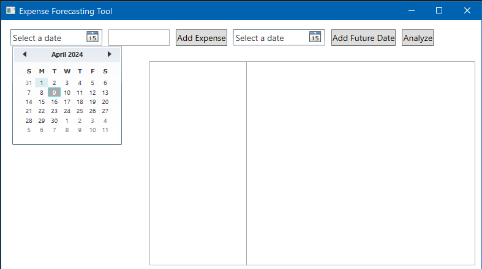

# Expense Forecasting Tool User Guide

Welcome to the Expense Forecasting Tool user guide! This guide will walk you through the steps to use the tool effectively.

## Table of Contents

1. [Introduction](#introduction)
2. [Getting Started](#getting-started)
3. [Adding Historical Expenses](#adding-historical-expenses)
4. [Predicting Future Expenses](#predicting-future-expenses)
5. [Viewing Results](#viewing-results)
6. [Conclusion](#conclusion)

## Introduction

The Expense Forecasting Tool is designed to help you predict future expenses based on historical data. By analyzing your past expenses, the tool provides insights into potential future expenditures, aiding in financial planning and budgeting.

## Getting Started

1. **Open the Application**: Launch the Expense Forecasting Tool application on your computer.

2. **Interface Overview**: Familiarize yourself with the tool's interface, which includes buttons for adding historical expenses, adding future dates for prediction, and analyzing the data.

## Adding Historical Expenses

1. **Select Date**: Click on the date picker to choose the date of the historical expense.

2. **Enter Expense Amount**: Input the expense amount in the designated textbox.

3. **Add Expense**: Click the "Add Expense" button to add the historical expense. The added expenses will be displayed in the list box for reference.

   

## Predicting Future Expenses

1. **Select Dates for Prediction**: Use the date picker to select future dates for expense prediction.

2. **Analyze Data**: Click on the "Analyze" button to analyze the historical data and predict expenses for future dates.

## Viewing Results

1. **Result**: The predicted expenses for the selected future dates will be displayed in the list box.

## Conclusion

Congratulations! You have successfully learned how to use the Expense Forecasting Tool to analyze historical expenses and predict future expenditures. Start planning your finances with confidence using this powerful tool.
