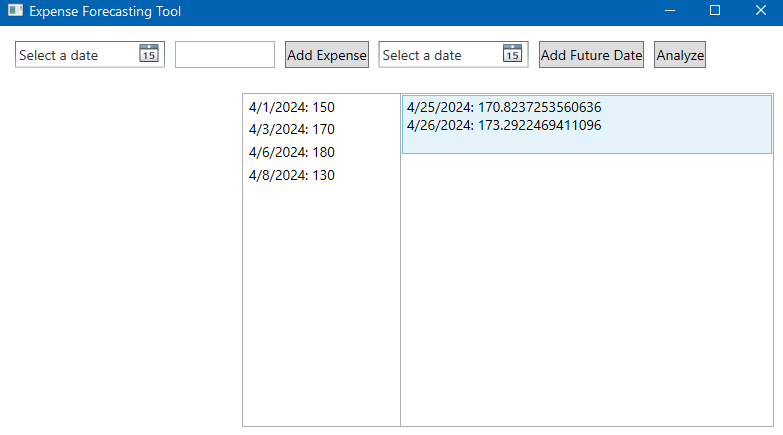

# Expense Forecasting Tool

The Expense Forecasting Tool is a simple desktop application developed using C# and WPF (Windows Presentation Foundation) to assist users in predicting future expenses based on historical data.

   


## Table of Contents

1. [Features](#features)
2. [Installation](#installation)
3. [Usage](#usage)
4. [Dependencies](#dependencies)
5. [Contributing](#contributing)
6. [License](#License)

## Features

- **Add Historical Expenses**: Users can input historical expenses along with their respective dates.
- **Add Future Dates**: Future dates can be added to the tool for predicting expenses.
- **Analyze and Predict**: Utilizes statistical analysis to analyze historical data and predict expenses for future dates.
- **Statistical Calculations**: Uses the MathNet.Numerics library for statistical calculations, ensuring accurate predictions.

## Installation

To run the Expense Forecasting Tool on your machine, follow these steps:

1. **Clone the repository**:

    ```bash
    git clone <https://github.com/mirzoyanvahe/ExpenseForecastingTool.git>
    ```

2. **Open in Visual Studio**:

    Open the project in Visual Studio by double-clicking on the solution file (`WpfApp1.sln`).

3. **Restore NuGet Packages**:

    Visual Studio should automatically restore the NuGet packages, but if not, right-click on the solution and select "Restore NuGet Packages".

4. **Build and Run**:

    Press `F5` or click on the "Start" button in Visual Studio to build and run the project.

## Usage

To make the most out of the application, follow these steps:

1. **Adding Historical Expenses**:
    - Choose a date from the date picker.
    - Input the expense amount in the designated textbox.
    - Click "Add Expense" to include the historical expense.

2. **Incorporating Future Dates**:
    - Select a future date via the date picker.
    - Hit "Add Future Date" to integrate the future date for expense prediction.

3. **Analysis and Prediction**:
    - Utilize the "Analyze" button to examine historical data and forecast expenses for future dates.
    - Predicted expenses will be presented in the list box.

For more detailed instructions and insights, refer to the [User Guide](/Documentation/UserGuide.md).

## Dependencies

The Expense Forecasting Tool relies on the following external libraries:

- [MathNet.Numerics](https://www.nuget.org/packages/MathNet.Numerics/): A numerical library for .NET applications.

Ensure that these dependencies are installed to run the application successfully.

## Contributing

Contributions to the Expense Forecasting Tool are welcome! If you find any issues or have suggestions for improvements, feel free to submit bug reports, feature requests, or pull requests.

## License

This project is licensed under the MIT License. See the [LICENSE](LICENSE.txt) file for details.
